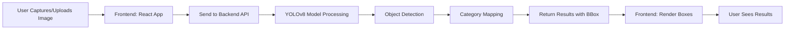

# 🌿 EcoScrutinize - AI-Powered Waste Segregation System

An intelligent waste segregation application powered by YOLOv8 object detection that helps users identify and properly dispose of waste items using real-time camera detection.


---

## 📋 Table of Contents

- [Overview](#overview)
- [Features](#features)
- [Tech Stack](#tech-stack)
- [Model Information](#model-information)
- [Project Structure](#project-structure)
- [Installation & Setup](#installation--setup)
- [Usage](#usage)
- [API Documentation](#api-documentation)
- [How It Works](#how-it-works)
- [Troubleshooting](#troubleshooting)
- [Contributing](#contributing)
- [License](#license)

---

## 🌟 Overview

**EcoScrutinize** is an AI-powered waste segregation assistant that uses computer vision to identify waste items and classify them into appropriate disposal categories. The application features a modern React frontend with real-time camera detection and a FastAPI backend powered by a custom-trained YOLOv8 model.

### Key Highlights

- **Real-time Detection**: Instant waste classification using webcam or uploaded images
- **Smart Classification**: Categorizes waste into Recyclable, Organic, Landfill, and Hazardous
- **Interactive UI**: Beautiful, glassmorphic design with smooth animations
- **Impact Tracking**: Monitor your environmental impact over time
- **Mobile Optimized**: Best experience on mobile devices with camera access

---

## ✨ Features

### 🎯 Core Features

- **Live Camera Detection**: Capture images directly from your device camera
- **Upload & Analyze**: Upload existing images for waste classification
- **Bounding Box Visualization**: See exactly what objects are detected with pixel-perfect positioning
- **Multi-Item Detection**: Detect and classify multiple waste items simultaneously
- **Confidence Scores**: View detection confidence for each identified item
- **Waste Categories**:
  - 🌿 **Organic** (Wet/Compostable waste)
  - ♻️ **Recyclable** (Dry/Recyclable materials)
  - 🗑️ **Landfill** (Non-recyclable waste)
  - ⚠️ **Hazardous** (Dangerous materials)

### 📊 Additional Features

- **Scan History**: Track all your scanned items
- **Impact Dashboard**: Visualize environmental impact metrics
- **Insights Screen**: Detailed breakdown of waste composition
- **Drop-off Finder**: Locate nearby waste disposal facilities (planned)
- **Voice Assistant**: AI-powered chat for waste disposal guidance (planned)

---

## 🛠️ Tech Stack

### Frontend

- **React 18** - UI framework
- **Vite** - Build tool and dev server
- **Tailwind CSS** - Utility-first styling
- **Framer Motion** - Smooth animations
- **Lucide React** - Icon library
- **React Webcam** - Camera integration

### Backend

- **FastAPI** - Modern Python web framework
- **Ultralytics YOLOv8** - Object detection model
- **Pillow** - Image processing
- **PyTorch** - Deep learning framework
- **Uvicorn** - ASGI server

---

## 🤖 Model Information

### YOLOv8 Custom Model

The application uses a **custom-trained YOLOv8 model** specifically for waste detection and classification.

#### Model Details

- **Architecture**: YOLOv8 (You Only Look Once v8)
- **Training Dataset**: Custom waste classification dataset
- **Model File**: `backend/models/best.pt`
- **Input Size**: Variable (auto-scaled)
- **Output**: Bounding boxes with class predictions and confidence scores

#### Detected Classes

| Class ID | Class Name   | Frontend Category | Description                    |
| -------- | ------------ | ----------------- | ------------------------------ |
| 0        | `recyclable` | Recycle           | Plastic, paper, metal, glass   |
| 1        | `organic`    | Organic           | Food waste, biodegradable items|
| 2        | `reuse`      | Recycle           | Reusable items                 |

#### Model Performance

- **Confidence Threshold**: 30% (configurable)
- **Top N Detections**: Returns top 3 detections per image
- **Processing Speed**: ~100-500ms per image (CPU)
- **Accuracy**: Optimized for real-world waste items

#### How the Model Works

1. **Input**: Receives uploaded/captured image
2. **Preprocessing**: Resizes and normalizes image
3. **Detection**: YOLOv8 detects objects and returns bounding boxes
4. **Classification**: Each detection is classified into waste categories
5. **Post-processing**: Filters by confidence and returns top detections
6. **Output**: JSON with bounding boxes, categories, and confidence scores

---

## 📁 Project Structure

```
waste-segregate-app/
├── backend/
│   ├── main.py                 # FastAPI server
│   ├── models/
│   │   └── best.pt            # YOLOv8 model weights
│   └── requirements.txt       # Python dependencies
├── src/
│   ├── components/
│   │   ├── ScanScreen.jsx     # Main detection interface
│   │   ├── ItemDetailScreen.jsx
│   │   ├── InsightsScreen.jsx
│   │   ├── ImpactScreen.jsx
│   │   └── ImpactDashboard.jsx
│   ├── data/
│   │   └── wasteData.js       # Waste knowledge base
│   ├── App.jsx                # Main app component
│   └── main.jsx               # Entry point
├── public/                    # Static assets
├── package.json               # Node dependencies
└── README.md                  # This file
```

---

## 🚀 Installation & Setup

### Prerequisites

- **Node.js** (v16 or higher)
- **Python** (v3.8 or higher)
- **pip** (Python package manager)
- **Git** (for cloning)

### Step 1: Clone Repository

```bash
git clone <repository-url>
cd waste-segregate-app
```

### Step 2: Backend Setup

#### 2.1 Navigate to Backend

```bash
cd backend
```

#### 2.2 Create Virtual Environment (Recommended)

```bash
# Windows
python -m venv venv
venv\Scripts\activate

# macOS/Linux
python3 -m venv venv
source venv/bin/activate
```

#### 2.3 Install Dependencies

```bash
pip install -r requirements.txt
```

**Required packages:**
```
fastapi==0.115.6
uvicorn==0.32.1
python-multipart==0.0.20
ultralytics==8.3.52
pillow==11.0.0
```

#### 2.4 Verify Model File

Ensure `backend/models/best.pt` exists. If not, you'll need to:
- Train your own YOLOv8 model, OR
- Download a pre-trained model (the app will fallback to `yolov8n.pt`)

#### 2.5 Start Backend Server

```bash
python main.py
```

**Expected output:**
```
✅ Custom YOLO model loaded: best.pt
📊 Model class names: {0: 'recyclable', 1: 'organic', 2: 'reuse'}
INFO: Uvicorn running on http://0.0.0.0:8000
```

### Step 3: Frontend Setup

#### 3.1 Open New Terminal & Navigate to Root

```bash
cd waste-segregate-app
```

#### 3.2 Install Dependencies

```bash
npm install
```

#### 3.3 Start Development Server

```bash
npm run dev
```

**Expected output:**
```
VITE ready in XXX ms
➜ Local: http://localhost:5173/
```

### Step 4: Access Application

Open your browser and go to:
```
http://localhost:5173
```

---

## 💻 Usage

### 1. Camera Detection

1. **Allow Camera Access**: Grant camera permissions when prompted
2. **Position Waste Item**: Place waste item in front of camera
3. **Capture Image**: Click the white capture button
4. **View Results**: See detection results with bounding boxes

### 2. Upload Image

1. **Click Upload Button**: Click the upload icon in the scan interface
2. **Select Image**: Choose an image from your device
3. **Automatic Analysis**: Image is automatically sent to backend
4. **View Results**: Bounding boxes and categories appear on image

### 3. Understanding Results

- **Green Box (♻️)**: Recyclable waste
- **Orange Box (🌿)**: Organic/Compostable waste
- **Gray Box (🗑️)**: Landfill waste
- **Red Box (⚠️)**: Hazardous waste

Each box shows:
- Category name
- Confidence percentage
- Precise object location

---

## 📡 API Documentation

### Base URL

```
http://localhost:8000
```

### Endpoints

#### POST `/detect`

Detect and classify waste items in an image.

**Request:**
```http
POST /detect HTTP/1.1
Content-Type: multipart/form-data

file: <image_file>
```

**Response:**
```json
{
  "items": [
    {
      "item": "Organic",
      "bin": "Organic",
      "confidence": 0.95,
      "bbox": {
        "x": 100,
        "y": 150,
        "w": 200,
        "h": 180
      }
    }
  ]
}
```

**Response Fields:**
- `item`: Detected item type
- `bin`: Waste category (Recycle/Organic/Landfill/Hazardous)
- `confidence`: Detection confidence (0-1)
- `bbox`: Bounding box coordinates (x, y, width, height)

---

## 🔧 How It Works

### Detection Pipeline



### Bounding Box Rendering

The app uses a sophisticated algorithm to handle `object-fit: contain` letterboxing:

1. **Get Natural Dimensions**: Read original image size
2. **Calculate Aspect Ratio**: Compare image vs container aspect ratio
3. **Determine Letterboxing**: Identify horizontal or vertical letterboxing
4. **Calculate Offset**: Compute empty space offset
5. **Apply Scaling**: Scale coordinates to displayed size
6. **Add Offset**: Position boxes accounting for letterboxing

This ensures pixel-perfect bounding box positioning regardless of image size or aspect ratio.

---

## 🐛 Troubleshooting

### Backend Issues

**Problem**: `Model file not found`
```bash
Solution: Verify backend/models/best.pt exists
```

**Problem**: `ImportError: ultralytics module not found`
```bash
Solution: Install dependencies: pip install ultralytics
```

**Problem**: `Port 8000 already in use`
```bash
Solution: Kill process or change port in main.py
```

### Frontend Issues

**Problem**: `Camera not working`
```bash
Solution: 
1. Check browser permissions
2. Use HTTPS or localhost
3. Try different browser
```

**Problem**: `Bounding boxes misaligned`
```bash
Solution: Clear browser cache and reload
```

**Problem**: `API connection failed`
```bash
Solution: Ensure backend is running on http://localhost:8000
```

---

## 🤝 Contributing

Contributions are welcome! Please follow these steps:

1. Fork the repository
2. Create a feature branch (`git checkout -b feature/AmazingFeature`)
3. Commit changes (`git commit -m 'Add AmazingFeature'`)
4. Push to branch (`git push origin feature/AmazingFeature`)
5. Open a Pull Request

---

## 📄 License

This project is licensed under the MIT License - see the LICENSE file for details.

---

## 👏 Acknowledgments

- **Ultralytics** for YOLOv8 framework
- **FastAPI** for amazing Python web framework
- **React** and **Vite** teams for modern web tools
- **Tailwind CSS** for utility-first styling

---

## 📧 Contact

For questions or support, please open an issue in the repository.

---

**Made with 💚 for a cleaner planet**
